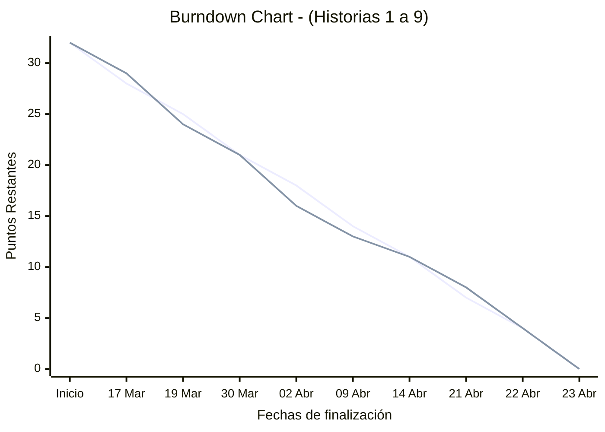

# 🟩🟨⬜ Proyecto Wordle - Ingeniería Web ⬜🟨🟩

**Integrantes del equipo:** Jaime Hernández Pérez 

---

## Descripción del Proyecto

Este repositorio contiene el desarrollo de una aplicación web basada en Wordle. El objetivo principal es mejorar las versiones existentes, resolviendo problemas de usabilidad, eliminando paywalls, y añadiendo un componente social.

### Características Principales:
* **Diseño 100% Responsive:** Adaptación perfecta tanto para dispositivos móviles como para resoluciones de escritorio.
* **Configuración Modular:** Permite elegir el idioma (Español/Inglés) y la longitud de la palabra (5 a 10 letras).
* **Persistencia de Datos:** Guardado de estado en caché para invitados y en Base de Datos para usuarios registrados.
* **Comunidad Integrada:** Sistema de usuarios, blog de comentarios y ranking competitivo ordenado por intentos y tiempo.
* **Accesibilidad:** Colores alternativo para personas daltónicas, tipografías para personas disléxicas, y más opciones.

---

## Metodología Ágil (Scrum)

El desarrollo de este proyecto sigue la metodología ágil Scrum, gestionada a través de las herramientas de GitHub. 

* **Product Backlog & Tablero Kanban:** Gestionado mediante [GitHub Projects](https://github.com/users/JaimeHP05/projects/3).
* **Historias de Usuario:** Registradas como Issues con etiquetas de estimación (points) y tipo (type).
* **Sprints:** Organizados mediante Milestones de 2 semanas de duración.

### Planificación de Sprints:
1. **Sprint 1:** Interfaz visual (tablero) y sistema de entrada (teclado virtual y físico).
2. **Sprint 2:** Lógica del motor (diccionarios, validación de palabras y evaluación de colores).
3. **Sprint 3:** Persistencia de estado, histórico de 5 días y sistema de autenticación.
4. **Sprint 4:** Panel de estadísticas, ranking global, blog de la comunidad y resolución de bugs.

---

## Seguimiento y Progreso (Burndown Chart)

A continuación, se muestra el Burndown Chart para reflejar el progreso del trabajo frente al tiempo estimado:

---

## Stack Tecnológico
* **Frontend:** HTML5, CSS3, JavaScript.
* **Backend:** Node.js, Express.
* **Base de Datos:** SQLite.
* **Control de Versiones:** Git & GitHub.
