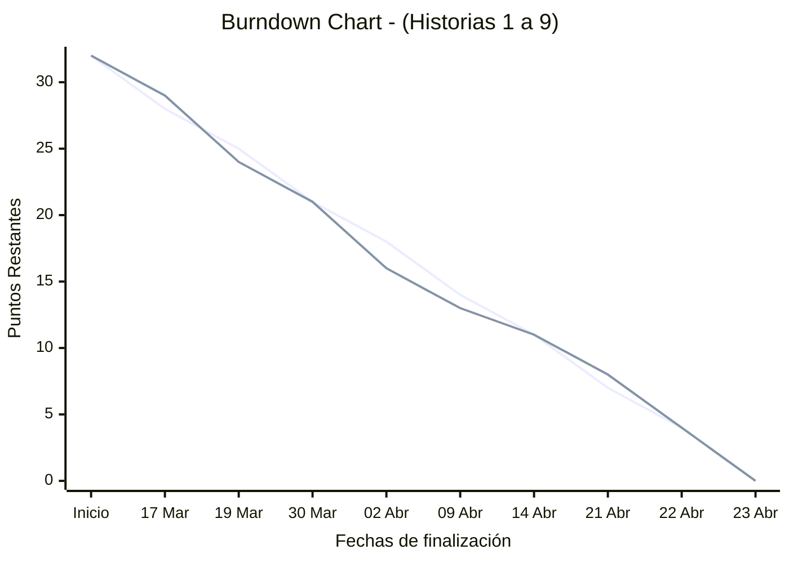

# 🟩🟨⬜ Proyecto Wordle - Ingeniería Web ⬜🟨🟩

**Autor:** Jaime Hernández Pérez

---

## Descripción

Este repositorio contiene una versión personalizada del juego Wordle desarrollada como proyecto de Ingeniería Web. La aplicación incluye funcionalidades de juego, persistencia local, autenticación de usuarios, estadísticas, ranking global y un blog comunitario.

El objetivo del proyecto es ofrecer una experiencia de juego más completa y accesible que una implementación básica de Wordle, incorporando además opciones de configuración y mejoras de usabilidad.

---

## Características

- Juego tipo Wordle con teclado virtual y soporte para teclado físico.
- Selección de idioma: español e inglés.
- Selección de longitud de palabra entre 5 y 10 letras.
- Guardado del estado de partida en `localStorage`.
- Registro e inicio de sesión de usuarios.
- Persistencia de partidas, estadísticas y mensajes en SQLite.
- Panel de estadísticas con distribución de intentos, racha actual y mejor racha.
- Ranking global de jugadores ordenado por media de intentos y tiempo.
- Blog comunitario para publicar mensajes.
- Historial de palabras jugadas en los últimos 5 días.
- Opciones de accesibilidad:
  - modo claro
  - alto contraste / modo daltónico
  - fuente para dislexia
  - reducción de animaciones
- Interfaz adaptada a escritorio y dispositivos móviles.

---

## Tecnologías

- **Frontend:** HTML5, CSS3 y JavaScript
- **Backend:** Node.js y Express
- **Base de datos:** SQLite
- **Dependencias principales:** `express`, `sqlite3`, `bcryptjs`, `cors`

---

## Estructura del proyecto

- [index.html](index.html): Estructura principal de la interfaz.
- [style.css](style.css): Estilos visuales y responsive design.
- [script.js](script.js): Lógica del juego, configuración, accesibilidad y comunicación con el servidor.
- [server.js](server.js): API REST, autenticación, guardado de partidas, blog y ranking.
- `wordle.db`: Base de datos SQLite generada automáticamente al arrancar el servidor.

---

## Requisitos previos

- Node.js instalado.
- npm instalado.
- Conexión a internet para descargar los diccionarios desde GitHub Raw.

---

## Instalación y ejecución

1. Clona o descarga el repositorio.
2. Abre una terminal en la carpeta del proyecto.
3. Instala las dependencias:

```bash
npm install
```

4. Inicia el servidor:

```bash
node server.js
```

5. Abre el navegador en:

```text
http://localhost:3000
```

---

## Funcionamiento

- Al arrancar, el servidor crea automáticamente la base de datos SQLite si no existe.
- El juego descarga el diccionario correspondiente al idioma seleccionado.
- La configuración del usuario y el estado de la partida se guardan en el navegador.
- Los usuarios registrados pueden consultar estadísticas, ranking y usar el blog.

---

## Metodología de trabajo

El proyecto se desarrolló siguiendo una organización basada en Scrum y GitHub Projects, con planificación por sprints, historias de usuario y seguimiento mediante tablero Kanban.


```mermaid
xychart-beta
    title "Burndown Chart - (Historias 1 a 9)"
    x-axis "Fechas de finalización" ["Inicio", "17 Mar", "19 Mar", "30 Mar", "02 Abr", "09 Abr", "14 Abr", "21 Abr", "22 Abr", "23 Abr"]
    y-axis "Puntos Restantes" 0 --> 32
    line "Progreso Ideal" [32, 28, 25, 21, 18, 14, 11, 7, 4, 0]
    line "Progreso Real"  [32, 29, 24, 21, 16, 13, 11, 8, 4, 0]
```

* **Product Backlog & Tablero Kanban:** Gestionado mediante [GitHub Projects](https://github.com/users/JaimeHP05/projects/3).
* **Historias de Usuario:** Registradas como Issues con etiquetas de estimación (points) y tipo (type).
* **Sprints:** Organizados mediante Milestones de 2 semanas de duración.

### Planificación de Sprints:
**Sprint 1:** Interfaz visual (tablero) y sistema de entrada (teclado virtual y físico).
**Sprint 2:** Lógica del motor (diccionarios, validación de palabras y evaluación de colores).
**Sprint 3:** Persistencia de estado, histórico de 5 días y sistema de autenticación.
**Sprint 4:** Panel de estadísticas, ranking global, blog de la comunidad y resolución de bugs.
